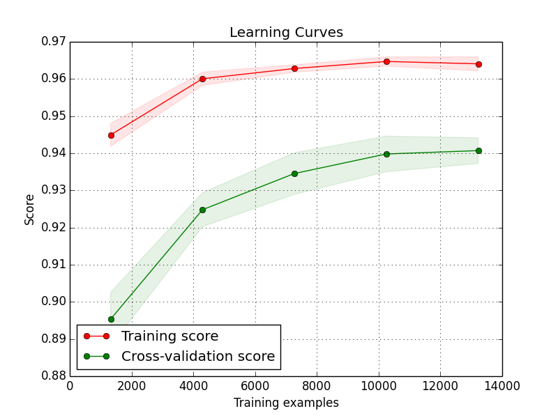

### Overview
  * This project aims at solving supervised binary classification problem (pad or knuckle), but can be easily extended to multi-classes problem without modifying the code much. The code performs a complete classification pipeline: feature selection, training & validation, predicting and hyperparameters tuning.
    
  * I widely experimented solving the problem using well-known classification techniques from different categories, and picked the one with highest accuracy. At each technique, I deeply exploited its potential by tunning its hyperparameters, performing feature selection, and standardizing the input data. The 4 classification techniques that I chose are as belows:
    ```
    Gaussian Naive Bayes < Nu SVM < Neural Network < Extra Trees
    ```
    (`A < B` means `B` performs better than `A` in my tests.)

  * Repo structure:
  ```
  --scikit_learn_classification
      |--README.md                  # documentation
      |--requirement.txt            # support Python packages installation
      |--src
            |--classifier.py        # classification codes
            |--data                 # contains test & train datasets
                |--test
                |--train
            |--utility.py           # helper methods
  ```

### Installation
1. Requires: Python 2.7

2. Install pip & Virtualenv
  * Ubuntu/Linux 64-bit
  ```
  sudo apt-get install python-pip python-dev python-virtualenv
  ```
  * Mac OS X
  ```
sudo easy_install pip
sudo pip install --upgrade virtualenv
  ```
3. Create and activate Virtualenv environment

  ```
virtualenv --system-site-packages ~/slc
source ~/slc/bin/activate                 # If using bash
  ```
4. Install necessary packages

  ```
pip install -r requirements.txt
  ```
5. Clone the repo
5. Copy `test` and `train` directories into `<Path_to_repo>/src/data`
5. Run the code

  ```
  cd src
  python classifier.py
  ```

### Pipeline

#### Dataset and Proprocessing

 * For each instance, I build the feature as combining information from both `audio.wav` (256 elements) and `touch.csv` (6 elements). The final feature has 262 elements for each instance. The naive feature (only from `audio.wav`) performed significantly worse than the combined feature above.
 * In training, we have 20657 labelled samples in total. We used 80% of it for training & hyperparameters tuning steps (16526 samples), and the rest 20% of it is for evaluating the precision of the estimated model (4131 sample).
 * The below learning curve shows the classification accuracies w.r.t number of samples. Increasing from 10,000 to 13,700 samples shows very little improvement in accuracy.
  
 * Standardize dataset is also an important step. I applied the `StandardScaler` technique, which removes the mean and scaling to unit variance. The mean and variance are extracted from only training data. Validation and testing data are scaled accordingly based on the training scaler.

#### Feature Selection (FS)

 * FS has several advantages (reduce overfiting, improve accuracy, reduce training time). I experiment with several techniques and empirically found that **Tree-based feature selection**, such as `ExtraTreesRegressor`, give better results.
 
 * As the name implied, **Tree-based FS** builds decision trees based on the input data and also calculates the importance of each input feature. With weighted features, I will remove unimportant ones by using `SelectFromModel` method. The hyperparameters  `threshold`, which specifies how much data will be kept, was empirically set to `0.24 * mean`. This roughly results in 188 features are kept (over 262 features in total).
 
 * Below is the classification results comparison with / without FS. I only focused on tuning `Extra Trees` and `Neural Network`. `Extra Trees` shows a clearly improvement in performance.

 |Classifier|Precision (FS disabled)| Precision (FS enabled)|
 |:-:|:-:|:-:|
 |Extra Trees|93.73%|94.65%|
 |Neural Network|94.34%|94.43%|

#### Hyperparameter Tuning
 * I decided to use **Random Search** technique for exploring extreamly high dimensional space of hyperparameters. Not like the traditional **Grid Search** technique, this generally gave good results while not taking too much time for tuning.
 
 * Typically, the workflow is as follows:
    1. For each technique, its important hyperparameters are predefined with ranges/values.
    1. If not triggered by flag `performTuning`, the normal training will be execued.
    1. If triggered, the searching will iterate training the model 20 times, each time with random values from predefined ranges/values. This process results in 20 candidates sorted from the highest `mean validation score` to the lowest.
    4. The hyperparameters of the highest `mean validation score` model are selected.
    
 * Random Search results: only show top 3 candidates for each technique
  - **Nu SVM**
  
    ```
    RandomizedSearchCV took 4753.75 seconds for 10 candidates parameter settings.
    Model with rank: 1
    Mean validation score: 0.8882 (std: 0.007)
    Parameters: {'kernel': 'rbf', 'nu': 0.4, 'degree': 2}

    Model with rank: 2
    Mean validation score: 0.7302 (std: 0.006)
    Parameters: {'kernel': 'rbf', 'nu': 0.8, 'degree': 7}

    Model with rank: 3
    Mean validation score: 0.7276 (std: 0.007)
    Parameters: {'kernel': 'sigmoid', 'nu': 0.8, 'degree': 4}
    ```
  
  - **Neural Network**
  
    ```
    RandomizedSearchCV took 2039.37 seconds for 20 candidates parameter settings.
    Model with rank: 1
    Mean validation score: 0.9400 (std: 0.003)
    Parameters: {'alpha': 0.005, 'learning_rate_init': 0.0001, 'hidden_layer_sizes': 116}

    Model with rank: 2
    Mean validation score: 0.9400 (std: 0.004)
    Parameters: {'alpha': 0.0005, 'learning_rate_init': 0.0001, 'hidden_layer_sizes': 114}

    Model with rank: 3
    Mean validation score: 0.9388 (std: 0.004)
    Parameters: {'alpha': 0.01, 'learning_rate_init': 0.0001, 'hidden_layer_sizes': 109}
    ```
  - **Extra Trees**
  
    ```
    RandomizedSearchCV took 615.16 seconds for 20 candidates parameter settings.
    Model with rank: 1
    Mean validation score: 0.9438 (std: 0.003)
    Parameters: {'max_features': 18, 'min_samples_split': 3, 'n_estimators': 127, 'min_samples_leaf': 1}

    Model with rank: 2
    Mean validation score: 0.9387 (std: 0.004)
    Parameters: {'max_features': 16, 'min_samples_split': 8, 'n_estimators': 91, 'min_samples_leaf': 2}

    Model with rank: 3
    Mean validation score: 0.9366 (std: 0.005)
    Parameters: {'max_features': 10, 'min_samples_split': 8, 'n_estimators': 112, 'min_samples_leaf': 1}
    ```

### Classification Result

 * With fine-tuned hyperparameters, I classified the evaluation dataset (20% of the original dataset), using each technique, 5 times and compute the mean precision (in `Evaluation` column).

 |Classifier|Accuracy (%)|
 |:-:|:-:|
 |Gaussian Naive Bayes|72.05%|
 |Nu SVM|89.45%|
 |Neural Network|94.43%|
 |Extra Trees|94.65%|

